# 🛒 Grocery Mart — Full-Stack Grocery E-Commerce Platform

> A role-based full-stack grocery e-commerce application built with **React.js**, **Spring Boot**, **Spring Security + JWT**, **Spring Data JPA/Hibernate**, **MySQL**, and **Razorpay**.

Grocery Mart provides an end-to-end digital grocery shopping workflow. Customers can browse products, manage their cart, place orders, make online payments, and track deliveries. Suppliers manage their own products and related orders, delivery agents manage assigned deliveries, and administrators control users, products, orders, suppliers, delivery partners, and platform operations.

---

## 📌 Table of Contents

- [Project Overview](#-project-overview)
- [Technology Stack](#-technology-stack)
- [System Architecture](#-system-architecture)
- [User Roles](#-user-roles)
- [End-to-End Application Flow](#-end-to-end-application-flow)
- [Customer Flow](#1-customer-shopping-flow)
- [Admin Flow](#2-admin-management-flow)
- [Supplier Flow](#3-supplier-product-and-order-flow)
- [Delivery Agent Flow](#4-delivery-agent-flow)
- [Authentication and Authorization](#-authentication-and-authorization)
- [Payment Flow](#-razorpay-payment-flow)
- [Inventory and Order Processing](#-inventory-and-order-processing)
- [Database](#-database)
- [Project Structure](#-suggested-project-structure)
- [Screenshots](#-application-screenshots)
- [Key Features](#-key-features)
- [Future Scope](#-future-scope)
- [How to Run](#-how-to-run)
- [Conclusion](#-conclusion)

---

## 📖 Project Overview

**Grocery Mart** is a full-stack grocery e-commerce platform designed to connect customers, suppliers, administrators, and delivery agents through a single application.

The application follows a layered architecture:

```text
React.js Frontend
       │
       │ HTTP / REST API
       ▼
Spring Boot Backend
       │
       ├── Spring Security + JWT
       ├── Controller Layer
       ├── Service Layer
       ├── Repository Layer
       │
       ▼
Spring Data JPA / Hibernate
       │
       ▼
MySQL Database

Payment:
Spring Boot Backend ─── Razorpay ─── Customer
```

The project report specifies React.js for the frontend, Spring Boot/Spring MVC for the backend, Spring Data JPA/Hibernate for persistence, MySQL for relational storage, JWT-based Spring Security for authentication/authorization, and Razorpay for online payment processing.

---

## 🧰 Technology Stack

| Layer | Technology |
|---|---|
| Frontend | React.js 18 |
| State Management | Redux |
| HTTP Client | Axios |
| UI | HTML5, CSS3, Bootstrap |
| Backend | Java 17+, Spring Boot 3.x |
| REST API | Spring MVC |
| Security | Spring Security + JWT |
| Persistence | Spring Data JPA + Hibernate |
| Database | MySQL 8.x |
| Payment Gateway | Razorpay |
| Backend Build | Maven |
| Frontend Build | npm |
| API Testing | Postman |
| Database Tool | MySQL Workbench |
| Backend Server | Embedded Apache Tomcat |

---

# 👥 User Roles

Grocery Mart implements four roles using Role-Based Access Control (RBAC).

### 👤 Customer

A customer can:

- Register and log in
- Browse products
- Search/filter products
- Add products to cart
- Review cart
- Provide delivery address
- Place an order
- Pay through Razorpay
- View payment result
- Track order status
- View order history
- Manage profile

### 👨‍💼 Admin

The admin has platform-wide management access:

- Manage users
- Manage products
- Manage categories
- Manage orders
- Manage suppliers
- Manage delivery agents
- Assign delivery agents
- Monitor payments
- View dashboards and operational information

### 🏪 Supplier

A supplier can:

- Manage their own products
- Add/update/delete product information
- Maintain price and stock
- Identify low-stock products
- View orders containing their products
- View supplier-specific dashboard information

### 🚚 Delivery Agent

A delivery agent can:

- View assigned orders
- View delivery details
- Update delivery status
- View delivery history

---

# 🔄 End-to-End Application Flow

The complete business flow can be understood as:

```text
User Registration
       ↓
User Login
       ↓
JWT Authentication
       ↓
Role-Based Dashboard
       ↓
Customer browses products
       ↓
Add Product to Cart
       ↓
Review Cart
       ↓
Enter Delivery Address
       ↓
Review Order
       ↓
Create Razorpay Order
       ↓
Razorpay Checkout
       ↓
Payment Verification
       ↓
Order Confirmed
       ↓
Inventory Updated
       ↓
Admin Processes Order
       ↓
Admin Assigns Delivery Agent
       ↓
Delivery Agent Receives Assigned Order
       ↓
Delivery Agent Updates Status
       ↓
Customer Tracks Updated Order
       ↓
Order Delivered
```

---

# 1️⃣ Customer Shopping Flow

## Step 1 — Home Page

The customer starts from the Grocery Mart home page.

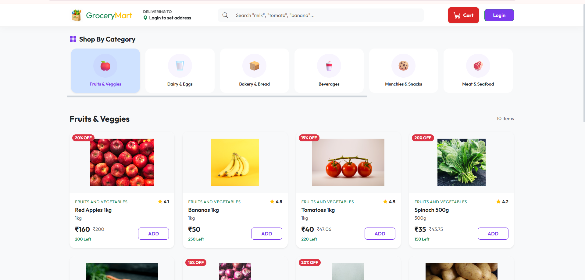

---

## Step 2 — Registration

A new user can create an account by providing registration details.

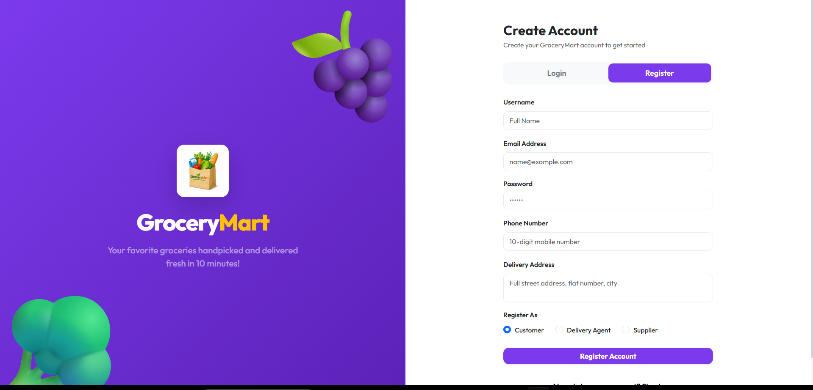

The system supports different roles, including Customer and Supplier.

---

## Step 3 — Login

The user logs in using their registered credentials.

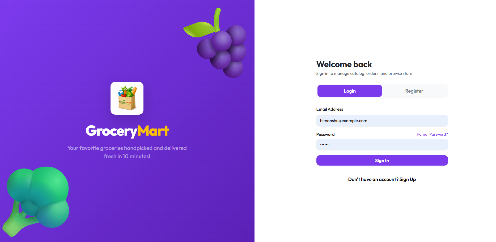

After successful authentication, the backend issues a signed JWT.

The JWT is then used for protected API requests.

---

## Step 4 — Customer Dashboard

After login, the customer gets access to the shopping interface.

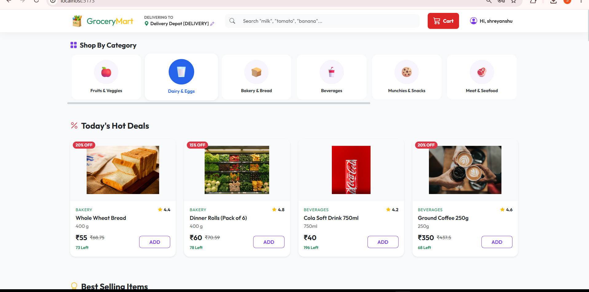

---

## Step 5 — Product Listing

The customer can browse available grocery products.

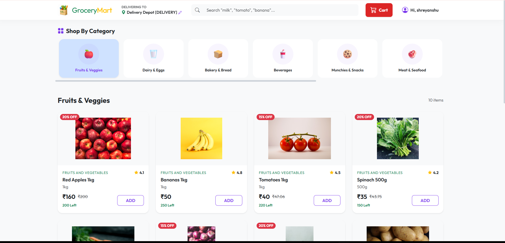

The application supports product browsing, searching, and category-based filtering.

---

## Step 6 — Add Products to Cart

The customer selects products and adds them to the shopping cart.

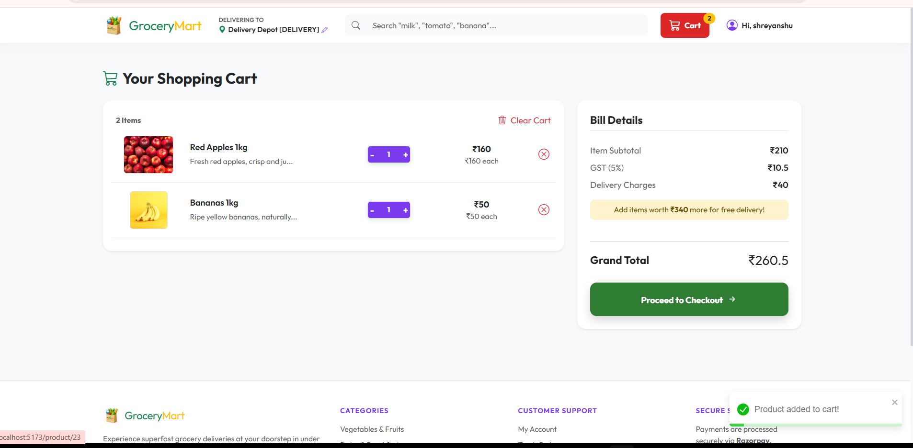

The cart represents the products selected before order placement.

---

## Step 7 — Delivery Address

Before placing the order, the customer provides/selects the delivery address.

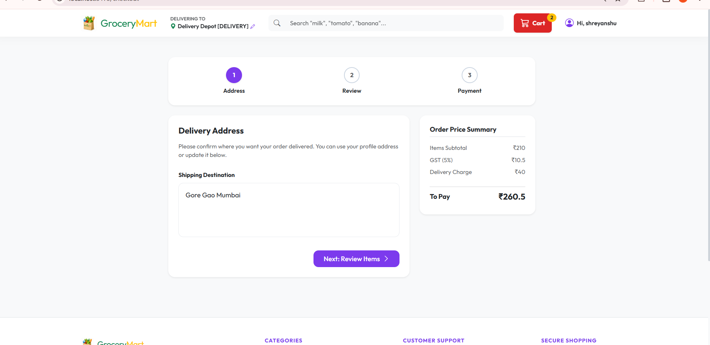

---

## Step 8 — Order Review

The customer reviews the order before proceeding to payment.

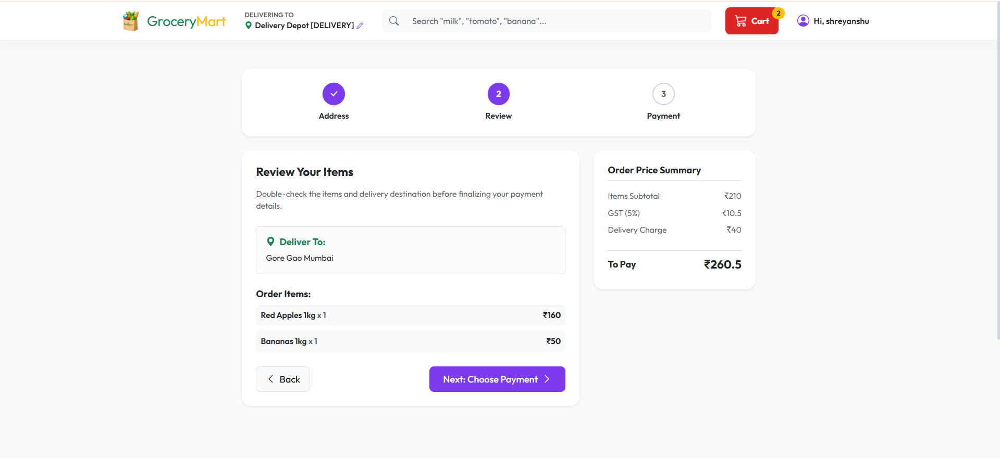

At this point, the customer verifies the selected products and order information.

---

# 2️⃣ Razorpay Payment Flow

## Step 9 — Razorpay Checkout

The application integrates Razorpay for online payment processing.

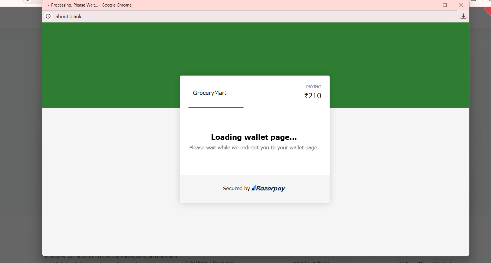

The backend creates the Razorpay order before checkout.

---

## Step 10 — Payment Confirmation

After completing the payment, the application receives the payment information required for verification.

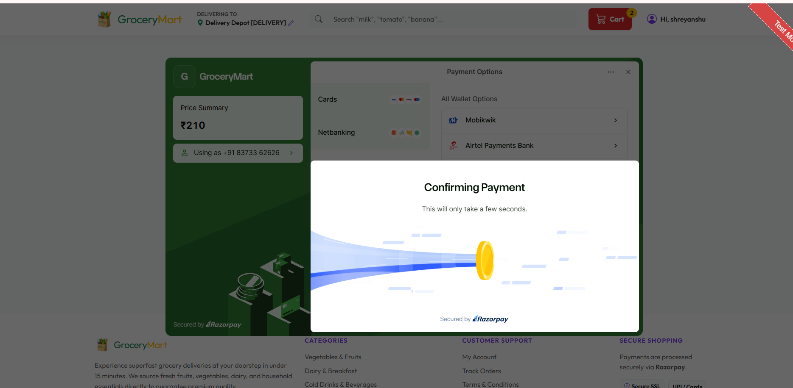

The project implements server-side payment signature verification before treating the payment as successful.

---

## Step 11 — Payment Success

After successful verification, the user receives the payment success result.

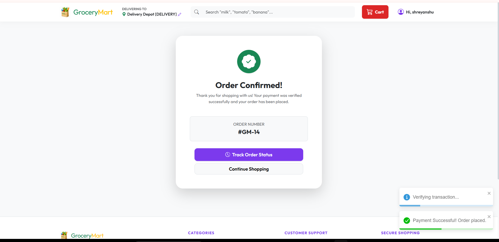

Payment information is persisted against the corresponding order.

---

# 3️⃣ Order Tracking Flow

## Step 12 — Track Order

The customer can track the order after successful placement.

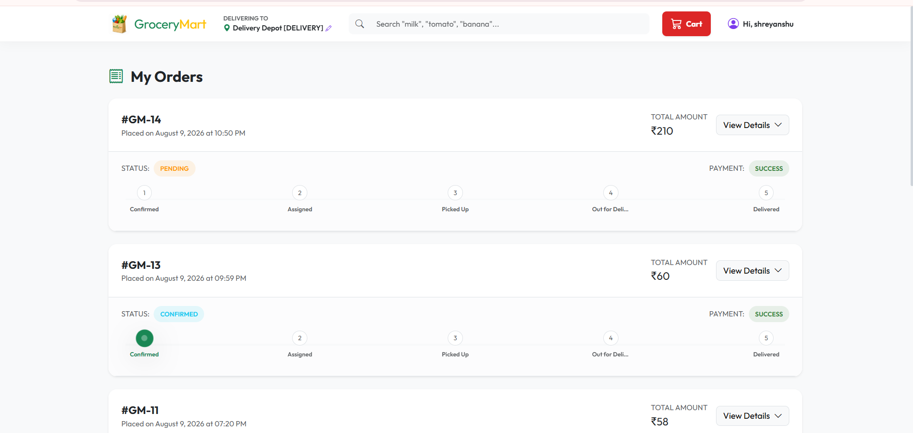

The order moves through its delivery lifecycle as it is processed.

---

## Step 13 — Updated Order Status

When the delivery workflow progresses, the customer can see the updated order status.

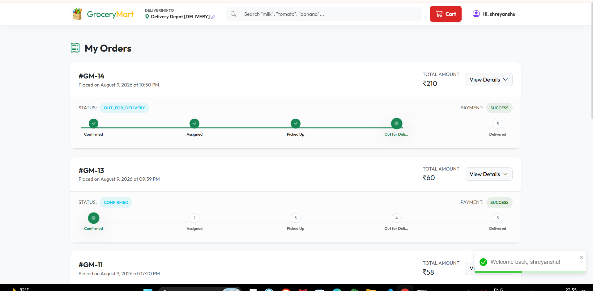

This connects the customer-facing order tracking flow with the admin and delivery-agent workflows.

---

# 4️⃣ Admin Management Flow

## Step 14 — Admin Dashboard

The administrator has a separate dashboard for platform management.

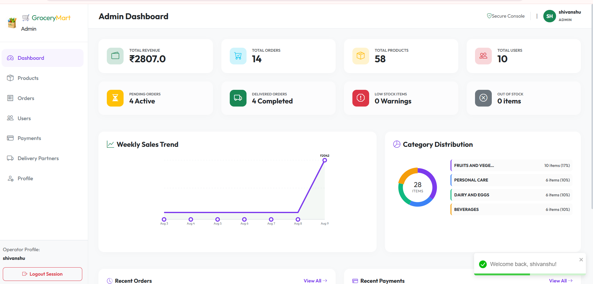

The admin can manage and monitor major platform operations.

---

## Step 15 — Admin Detailed Dashboard

The detailed dashboard provides additional operational information.

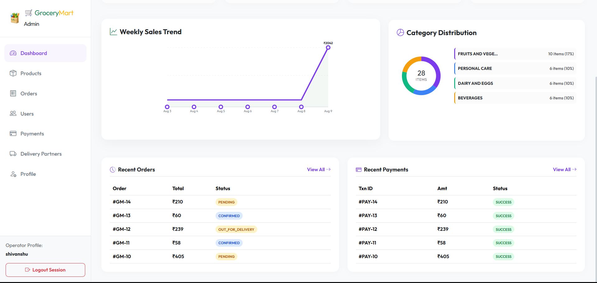

---

## Step 16 — Admin Order Management

The admin can view and manage customer orders.

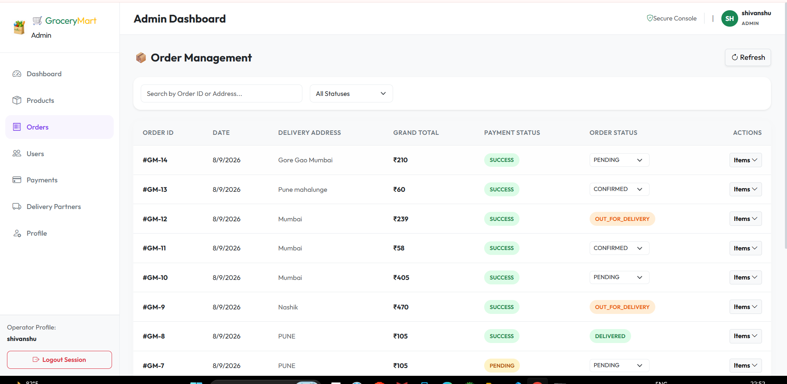

The order-management workflow allows the administrator to oversee fulfilment.

---

## Step 17 — Assign Delivery Partner

After order processing, the administrator can assign a delivery agent to the order.

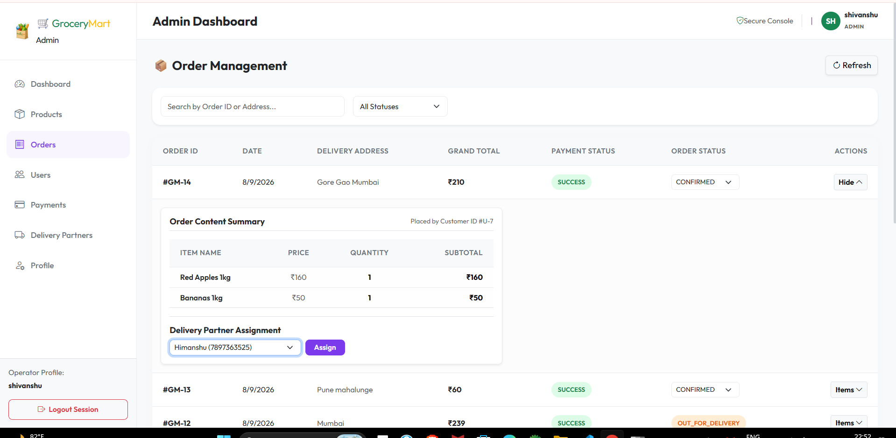

The flow becomes:

```text
Customer places order
        ↓
Payment completed
        ↓
Order confirmed
        ↓
Admin views order
        ↓
Admin assigns delivery agent
        ↓
Delivery agent receives assignment
```

---

# 5️⃣ Supplier Product and Order Flow

## Step 18 — Supplier Dashboard

Suppliers have a dedicated dashboard.

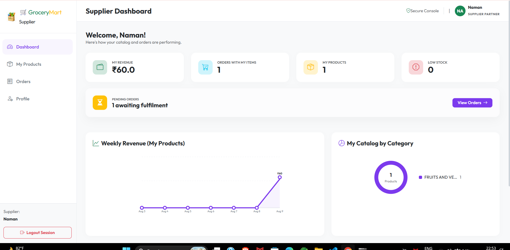

The supplier's access is restricted to their own catalogue and orders containing their products.

The supplier workflow includes:

```text
Supplier Login
      ↓
Supplier Dashboard
      ↓
Manage Own Products
      ↓
Maintain Price / Stock
      ↓
View Orders Containing Supplier Products
      ↓
Monitor Supplier-Specific Information
```

---

# 6️⃣ Delivery Agent Flow

## Step 19 — Delivery Agent Dashboard

Delivery agents receive a dedicated dashboard.

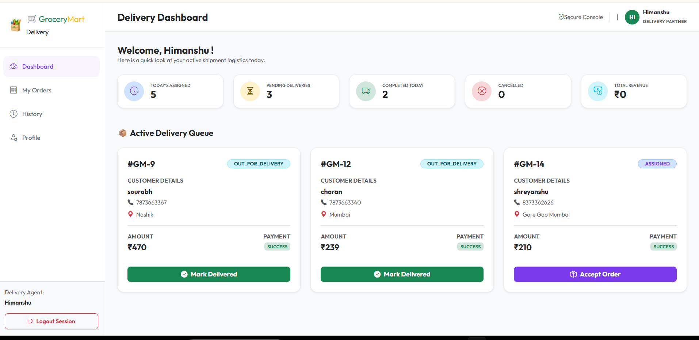

The delivery agent can access orders assigned to them.

---

## Step 20 — Delivery Agent Receives Order

The assigned order appears in the delivery agent's order section.

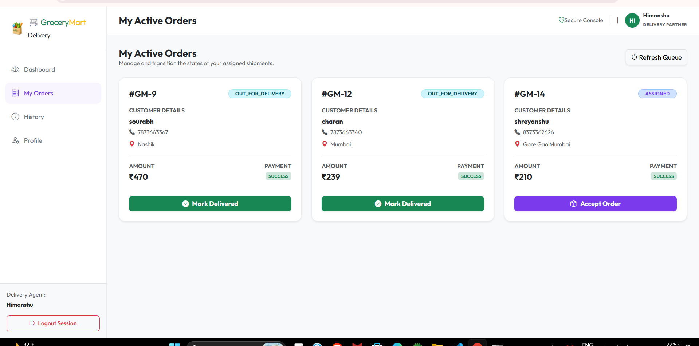

The delivery agent can update the delivery status as the order progresses.

```text
Admin Assignment
      ↓
Delivery Agent Receives Order
      ↓
View Order + Delivery Address
      ↓
Update Delivery Status
      ↓
Customer Sees Updated Status
      ↓
Delivery Completed
```

---

# 🔐 Authentication and Authorization

Grocery Mart uses **Spring Security + JWT**.

The authentication flow is:

```text
Login Request
     ↓
Spring Security
     ↓
Validate Email + Password
     ↓
Generate Signed JWT
     ↓
Return JWT to Frontend
     ↓
Frontend sends JWT with protected requests
     ↓
JWT Filter validates token
     ↓
Extract User Role
     ↓
Authorize / Reject Request
```

The project uses role-based authorization so that users only access resources permitted for their role.

### Access Model

| Role | Main Access |
|---|---|
| Customer | Products, Cart, Orders, Payment, Tracking, Profile |
| Admin | Users, Products, Categories, Orders, Suppliers, Delivery Agents |
| Supplier | Own Products, Own Stock, Related Orders, Supplier Dashboard |
| Delivery Agent | Assigned Orders, Delivery Status, Delivery History |

---

# 💳 Razorpay Payment Flow

The payment process is not handled only on the frontend.

The project follows a backend-assisted payment workflow:

```text
Customer
   ↓
Checkout
   ↓
React Frontend
   ↓
Spring Boot Backend
   ↓
Create Razorpay Order
   ↓
Razorpay Checkout
   ↓
Payment
   ↓
Payment Response
   ↓
Backend Signature Verification
   ↓
Payment Status Persisted
   ↓
Order Payment Confirmed
```

This approach allows the backend to verify the payment before the order is considered successfully paid.

---

# 📦 Inventory and Order Processing

Inventory is connected to the order-processing workflow.

The project specifies real-time stock tracking and automatic stock adjustment when orders are placed.

```text
Product Stock
     ↓
Customer Adds Product
     ↓
Cart
     ↓
Order Placement
     ↓
Stock Validation / Processing
     ↓
Inventory Adjustment
     ↓
Updated Stock
```

Low-stock products can be identified for replenishment.

---

# 🗄️ Database

The project uses **MySQL** with **Spring Data JPA + Hibernate**.

The report documents the following core tables:

```text
users
products
cart
cart_items
orders
order_items
payments
```

Conceptually, the order data is separated into:

```text
orders
   │
   └── order_items
          │
          └── products
```

Payment information is associated with the corresponding order:

```text
orders
   │
   └── payments
```

Cart data is separated into:

```text
cart
   │
   └── cart_items
          │
          └── products
```

---

# 🏗️ Suggested Project Structure

Based on the layered Spring Boot architecture described in the project report, the backend can be organized as:

```text
backend/
└── src/
    └── main/
        ├── java/
        │   └── .../
        │       ├── controller/
        │       ├── service/
        │       ├── repository/
        │       ├── entity/
        │       ├── dto/
        │       ├── security/
        │       ├── config/
        │       └── exception/
        │
        └── resources/
            └── application.properties

frontend/
└── src/
    ├── components/
    ├── pages/
    ├── services/
    ├── redux/
    ├── routes/
    └── assets/
```

> Adjust the folder names above if your actual GitHub repository uses different package/folder names.

---

# 📸 Application Screenshots

The repository includes screenshots covering the complete application workflow:

### Customer

- Home page
- Registration
- Login
- Product listing
- Cart
- Delivery address
- Order review
- Razorpay checkout
- Payment confirmation
- Payment success
- Order tracking
- Updated order status

### Admin

- Dashboard
- Detailed dashboard
- Order management
- Delivery partner assignment

### Supplier

- Supplier dashboard

### Delivery Agent

- Delivery dashboard
- Assigned orders

---

# ✨ Key Features

- Full-stack React + Spring Boot architecture
- REST API based frontend/backend communication
- JWT authentication
- Spring Security role-based authorization
- Four application roles
- Customer shopping workflow
- Product browsing and filtering
- Persistent shopping cart
- Order placement
- Razorpay online payment
- Server-side payment signature verification
- Inventory/stock management
- Supplier-specific product management
- Supplier-specific order visibility
- Admin order management
- Delivery-agent assignment
- Delivery status updates
- Customer order tracking
- MySQL relational database
- Spring Data JPA + Hibernate persistence
- Layered backend architecture
- Responsive frontend

---

# 🔮 Future Scope

The project report identifies several possible future improvements:

- Real-time order and delivery notifications using WebSockets
- Live delivery tracking with map-based routing
- Nearest delivery-agent assignment
- Mobile applications for customers and delivery agents
- AI-based product recommendations
- Basket suggestions
- Demand forecasting for inventory planning
- Subscription and scheduled repeat orders
- Coupons and loyalty points
- Wallet functionality
- Product reviews and ratings
- Centralized logging and monitoring
- Distributed tracing
- Docker and Kubernetes based deployment/scaling

---

# ▶️ How to Run

## Prerequisites

Install:

```text
Java 17+
Node.js
npm
MySQL 8+
Maven
```

You also need Razorpay credentials for the payment functionality.

---

## 1. Clone the Repository

```bash
git clone <YOUR_GITHUB_REPOSITORY_URL>
cd Grocery-Mart
```

---

## 2. Start MySQL

Create the required MySQL database and configure the database connection in the Spring Boot application's configuration.

Example configuration structure:

```properties
spring.datasource.url=jdbc:mysql://localhost:3306/<DATABASE_NAME>
spring.datasource.username=<MYSQL_USERNAME>
spring.datasource.password=<MYSQL_PASSWORD>
```

Use your actual project configuration values.

---

## 3. Configure Razorpay

Configure the Razorpay credentials required by the backend.

```properties
razorpay.key=<YOUR_RAZORPAY_KEY>
razorpay.secret=<YOUR_RAZORPAY_SECRET>
```

Do **not** commit real credentials to GitHub.

For a public repository, keep secrets in environment variables or an external configuration mechanism.

---

## 4. Start Spring Boot Backend

From the backend directory:

```bash
mvn spring-boot:run
```

The Spring Boot application runs the REST API through embedded Tomcat.

---

## 5. Start React Frontend

From the frontend directory:

```bash
npm install
npm run dev
```

Open the frontend URL displayed by Vite/npm in the terminal.

---

# 🔗 Application Communication

The overall technical communication is:

```text
┌──────────────────────┐
│     React Frontend   │
│                      │
│ Components / Pages   │
│ Redux / Axios        │
└──────────┬───────────┘
           │
           │ HTTP REST API
           │ JWT
           ▼
┌──────────────────────┐
│   Spring Boot API    │
│                      │
│ Controllers          │
│ Services             │
│ Security / JWT       │
│ Repositories         │
└──────────┬───────────┘
           │
           │ JPA / Hibernate
           ▼
┌──────────────────────┐
│       MySQL          │
│                      │
│ Users                │
│ Products             │
│ Cart                 │
│ Orders               │
│ Payments             │
└──────────────────────┘

           │
           │ Payment API
           ▼
┌──────────────────────┐
│      Razorpay        │
└──────────────────────┘
```

---

# 🧪 API Testing

REST APIs can be tested using **Postman**.

Typical backend testing flow:

```text
Postman
   ↓
REST API Request
   ↓
Spring Security
   ↓
Controller
   ↓
Service
   ↓
Repository
   ↓
MySQL
   ↓
JSON Response
```

Protected APIs require the appropriate JWT authentication and role authorization.

---

# 🎯 Conclusion

Grocery Mart demonstrates the implementation of a production-style full-stack grocery e-commerce platform using modern frontend, backend, database, security, and payment technologies.

The application connects four different roles—**Customer, Admin, Supplier, and Delivery Agent**—and provides an end-to-end workflow from registration and product browsing to cart management, payment, order processing, delivery assignment, delivery-status updates, and customer tracking.

The project combines **React.js**, **Spring Boot**, **Spring Security/JWT**, **Spring Data JPA/Hibernate**, **MySQL**, and **Razorpay** to demonstrate practical full-stack development, secure authentication, role-based authorization, persistence, inventory management, order processing, and online payment integration.

---

